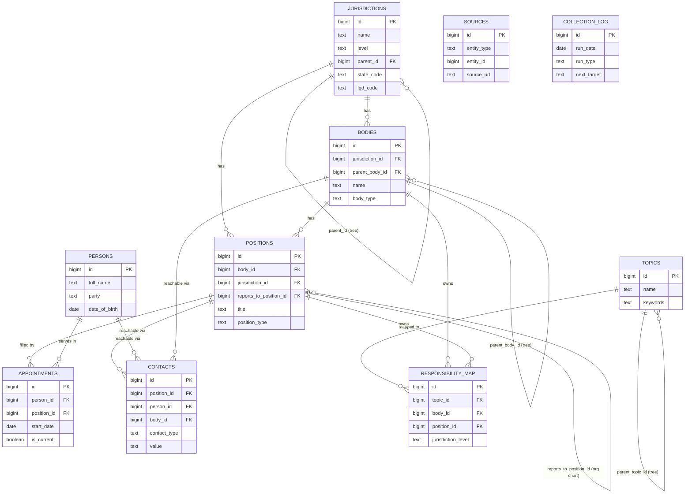

# Accountable India — Entity Relationship Diagram

This diagram shows how the tables connect. Open it in any Markdown viewer that
renders Mermaid (GitHub, VS Code with Mermaid plugin, etc.).

## How the app uses this

1. Citizen describes a problem in plain language.
2. App's AI matches the text against `topics.keywords`.
3. `responsibility_map` resolves the topic + citizen's location/jurisdiction
   level to the owning `bodies` / `positions`.
4. `appointments` (where `is_current = true`) → the actual `persons` in office.
5. `positions.reports_to_position_id` walks UP the chain of command.
6. `contacts` provides the official email/phone for every link in that chain,
   so the app can email the whole escalation ladder at once.
