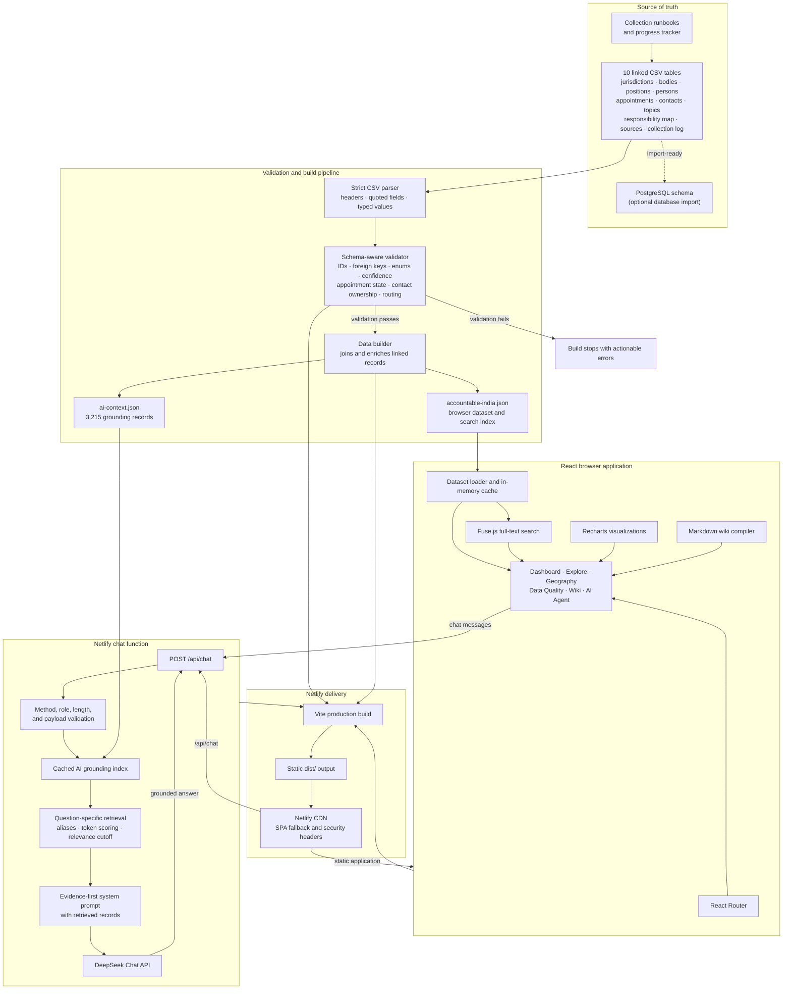

# Architecture

The Indian Government Org Chart is a static-first React application. Its source
of truth is a set of linked CSV files; no database is required at runtime. A
Netlify Function provides the only dynamic backend capability for grounded AI
questions.

## Runtime boundaries

| Boundary | Responsibility |
|---|---|
| CSV dataset | Canonical government entities, relationships, contacts, provenance, and collection history |
| Build pipeline | Reject malformed or inconsistent data, enrich relationships, and generate optimized runtime artifacts |
| Browser | Load the static dataset once, search locally, render dashboards, and display documentation |
| Netlify Function | Validate chat requests, retrieve relevant dataset evidence, and call DeepSeek without exposing the API key |
| DeepSeek | Generate a response from the system instructions and retrieved records; it does not receive the complete raw dataset |
| PostgreSQL schema | Optional deployment target for consumers that need a queryable database; it is not used by the hosted application |

## Data flow

1. Contributors update the linked files in `Accountable India/data/`.
2. `npm run validate:data` verifies file structure, constraints, and relationships.
3. `scripts/build-data.mjs` joins the tables and generates:
   - `accountable-india.json` for dashboards and Fuse.js search.
   - `ai-context.json` for server-side question-specific retrieval.
4. Vite builds the React application, and Netlify publishes the static output
   together with the `/api/chat` function.
5. Chat requests retrieve only the most relevant records before contacting
   DeepSeek, keeping prompts bounded and reducing unsupported answers.

## Quality gates

The production build runs CSV validation automatically. The repository also
provides:

- `npm run typecheck`
- `npm test`
- `npm run test:chat:coverage`
- `npm run build`

The chat core is covered across successful responses, missing configuration,
input rejection, grounding retrieval, upstream failures, and malformed requests.
